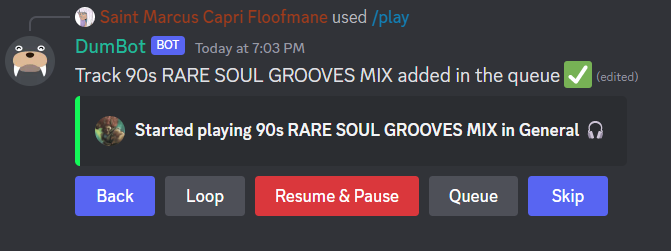
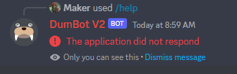

# :icon-question: Frequently Asked Questions

## Common Bugs

### When bot first enters chat, the queue doesn't save and the player doesn't pop up

This can happen for 2 reasons. Either DumBot just got an update and since it just reloaded its unsure of where its at, or your hosted version of DumBot has gone into sleep mode because you are using the free version. 

Either way the fix is the same. Simply disconnect DumBot from voice by either using `/stop` or by having everyone in voice leave the channel. Once DumBot is disconnected he should be good to go. You will know he is working because the player will show up in chat like this:

### When looping queue or track, the previous song gets added to the end of queue twice

This is an error that came about from a fix to another error.  Essentially before when a song would end it would skip ahead 2 songs. In order to fix that I made it so when you use `/skip` it duplicates the next song if it isn't the same as the currently playing song, adds it next up in queue, skips over the first version, and plays the second version. 

Unfortunately when you loop though now it duplicates the song twice instead of once due to the nature of the loop method. I prefer having loop be kind of broken then skip so for now there is no fix. 

### When I call DumBot he responds with "The application did not respond" for a few seconds before working

This should only happen if you are hosting DumBot yourself on an eco plan on Heroku. Essentially whats happening is on the cheapest Heroku plan DumBot goes to sleep after 30 minutes. It takes the server about 15 seconds to wake up. For $7 you can bump up your plan and have DumBot running at all times, thus fixing the error. 

If you don't want to upgrade unfortunately he will go to sleep every 30 minutes.

