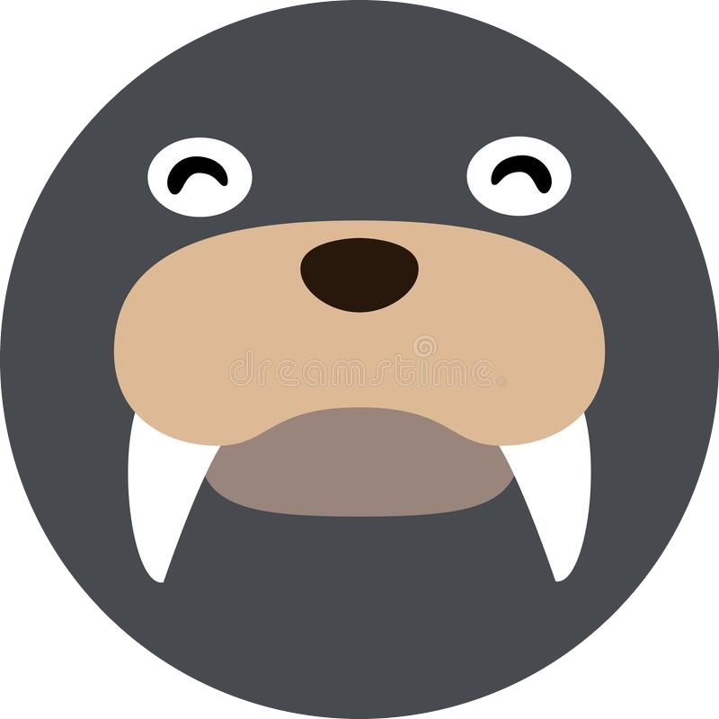

# STILL IN DEVELOPMENT

<!-- SHIELDS -->

<!-- PROJECT LOGO & HEADER -->

 

  <h3 align="center"><strong>Discord DumBot</strong></h3>

  

    <strong>A simple discord bot to build your own on top of</strong>
     
    Pre loaded with dice rolling and music functionality
     
     
    <a href="https://github.com/othneildrew/Best-README-Template">View Demo</a>
    ·
    <a href="https://github.com/Mateo-Wallace/Best-README-Template/issues">Report Bug</a>
    ·
    <a href="https://github.com/othneildrew/Best-README-Template/issues">Request Feature</a>
  

<!-- TABLE OF CONTENTS -->

  
Table of Contents

  <ol>
    <li>
      <a href="#about-the-project">About The Project</a>
      <ul>
        <li><a href="#built-with">Built With</a></li>
      </ul>
    </li>
    <li>
      <a href="#libraries">Libraries</a>
      <ul>
        <li><a href="#prerequisites">Prerequisites</a></li>
        <li><a href="#installation">Installation</a></li>
      </ul>
    </li>
    <li><a href="#contributing">Contributing</a></li>
    <li><a href="#license">License</a></li>
    <li><a href="#contact">Contact</a></li>
    <li><a href="#acknowledgments">Acknowledgments</a></li>
  </ol>

<!-- ABOUT THE PROJECT -->

## About The Project

   
  
   
   

Have you ever wanted a bot that you had full control over? No worrying about the bot shutting down and having to search for a new one? That's exactly the niche that DumBot is trying to fill! The goal of DumBot is instead of adding a random bot to your server you can host the bot yourself and add it to whatever servers you would like! With basic JavaScript knowledge you can also add your own commands and turn on and off existing commands.

Main Features:

- Dice Roller
- Music Player

This README will run you through how to download, edit, deploy, and use this code to create a bot of your own. For those of you that do not wish to host the bot yourself you can also simply use my deployed version.

(<a href="#readme-top">back to top</a>)

### Built With

(<a href="#readme-top">back to top</a>)

<!-- LIBRARIES -->

## Libraries

The below libraries detail how to use all versions of the bot and how to get it up and running. Please select the library that best fits your use case.

- [deploy your version]()
- [use my version in your discord]()
- [using the bot in discord]()

(<a href="#readme-top">back to top</a>)

<!-- CONTRIBUTING -->

## Contributing

Contributions are what make the open source community such an amazing place to learn, inspire, and create. Any contributions you make are **greatly appreciated**.

If you have a suggestion that would make this better, please fork the repo and create a pull request. You can also simply open an issue with the tag "enhancement".
Don't forget to give the project a star! Thanks again!

1. Fork the Project
1. Create your Feature Branch (`git checkout -b feature/AmazingFeature`)
1. Commit your Changes (`git commit -m 'Add some AmazingFeature'`)
1. Push to the Branch (`git push origin feature/AmazingFeature`)
1. Open a Pull Request

If all of this is new to you take a look at the [GitHub Docs](https://docs.github.com/en/get-started/quickstart/fork-a-repo).

(<a href="#readme-top">back to top</a>)

<!-- LICENSE -->

## License

Distributed under the MIT License. See [LICENSE](./LICENSE) for more information.

(<a href="#readme-top">back to top</a>)

<!-- CONTACT -->

## Contact

Mateo Wallace - [GitHub](https://github.com/Mateo-Wallace) - [Email](mailto:mateo.t.wallace@gmail.com) - [LinkedIn](https://www.linkedin.com/in/mateo-wallace/)

Project Link: [MP2-Discord-DumBot-V2](https://github.com/Mateo-Wallace/MP2-Discord-DumBot-V2)

(<a href="#readme-top">back to top</a>)

<!-- ACKNOWLEDGMENTS -->

## Acknowledgments

I am appreciative for the source code, ideas, and inspiration that all of these repos and creators have provided to this project. If you see anything within my code that you recognize as yours and don't see yourself listed here please feel free to open an issue and I will add you!

- [ZerioDev - Music-bot](https://github.com/ZerioDev/Music-bot)
- [mngyuan - rollbot](https://github.com/mngyuan/rollbot)
- [othneildrew - Best-README-Template](https://github.com/othneildrew/Best-README-Template)

(<a href="#readme-top">back to top</a>)

