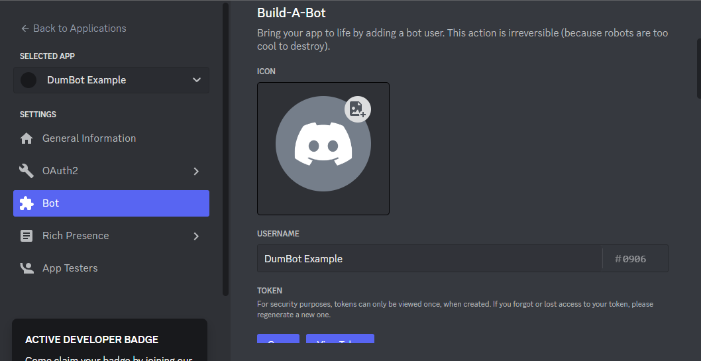
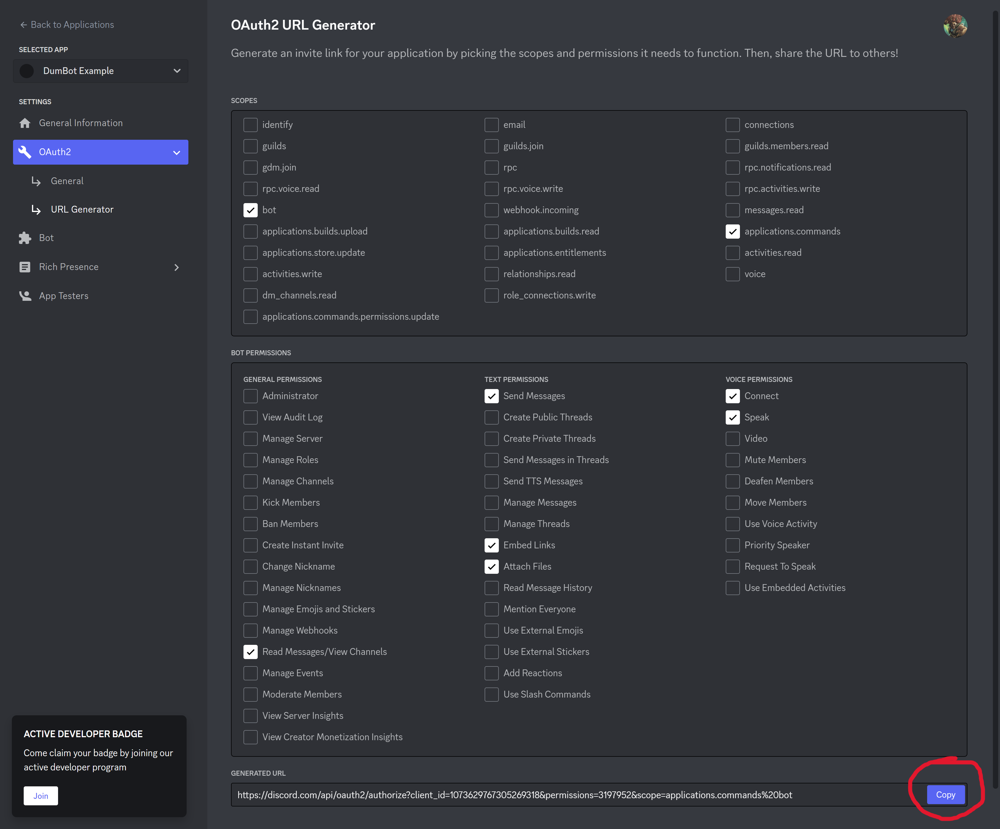
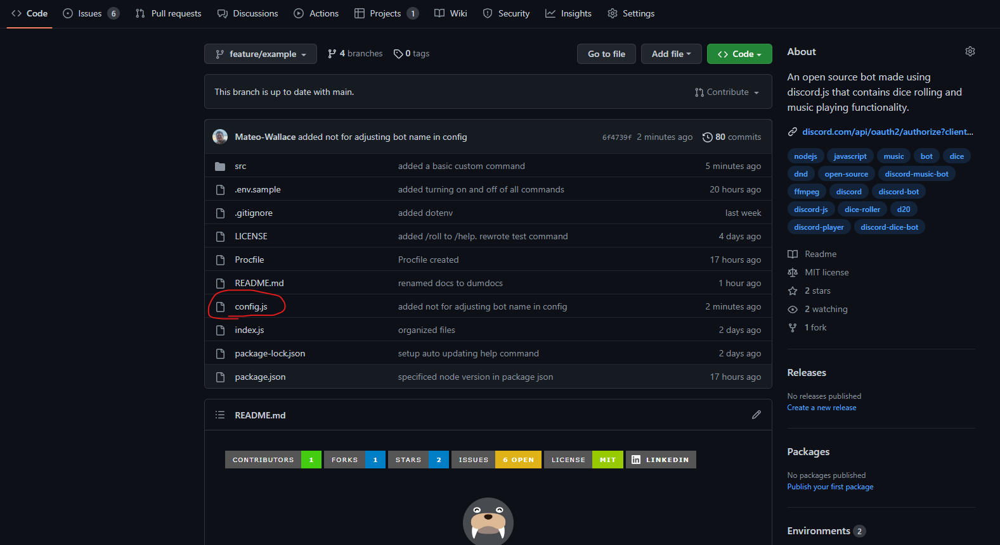
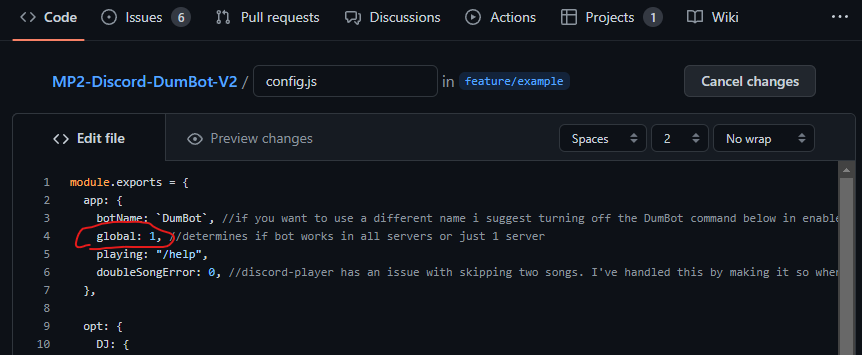
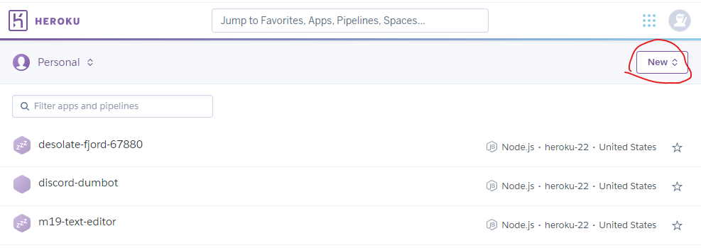
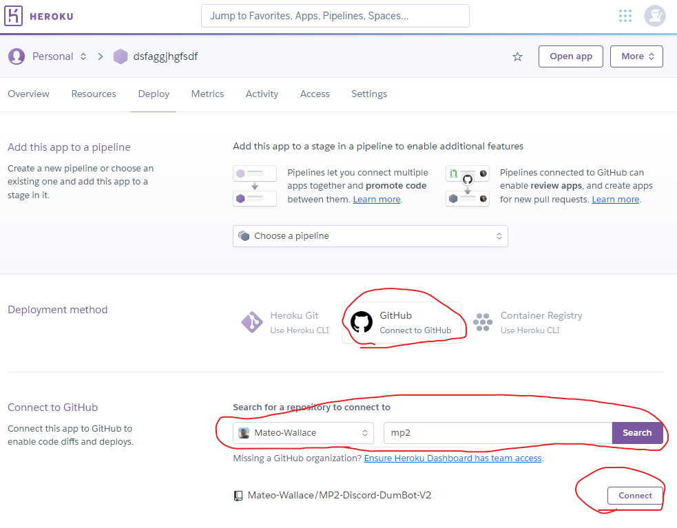
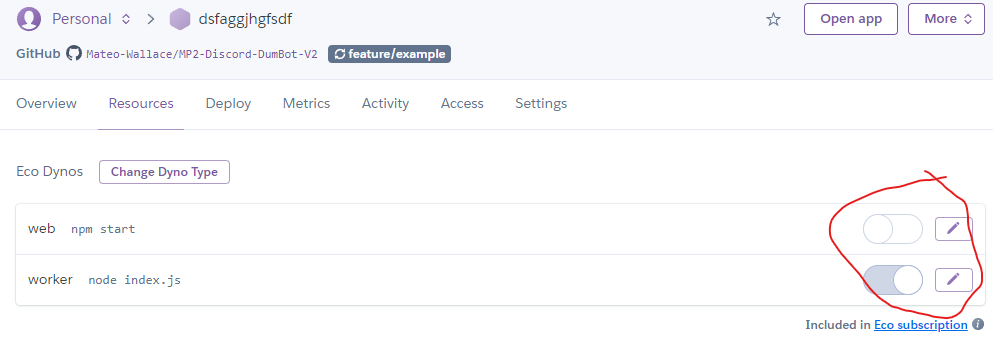

# :icon-server: Hosting Your Instance of DumBot

This document will set you up to have your own version of DumBot that you can fully customize the code of. This documentation will go super in depth so even if you have no coding knowledge you should be able to figure it out. Feel free to open a [discussion](https://github.com/Mateo-Wallace/Discord-DumBot/discussions) if you are having problems.

> :icon-info: **Note**
>
> Be aware before going through this process my solution to deploying is hosting on [Heroku](https://www.heroku.com/pricing) which is a **PAID** service. I researched into free solutions like [Glitch](https://glitch.com/pricing) but was unable to make it work. Heroku costs $5 for the lowest tier plan. That plan will put DumBot into sleep mode after 30 minutes. For $7 you can bump up your plan and have DumBot running at all times.
>
> If you find a way to run DumBot for free, even if it goes into sleep mode, that information would be amazing! Feel free to message me or open a discussion and I will add you as a contributor to the project.

## Setting Up A Discord Bot

Setting up a Discord Bot is extremely well detailed through the [Official Discord Developer Portal Documentation](https://discord.com/developers/docs/getting-started). Feel free to follow along both here and on those docs in order to accomplish setting up your bot.

1. Go to the [Discord Dev Portal Applications Tab](https://discord.com/developers/applications) and sign in if you aren't already. It should look something like this:

   

1. From that screen in the top right corner you should see a button called `New Application`. It's circled in red on the image above. Click that button and fill out the Name of your bot and agree to their terms of service. Then hit the `Create` button:

   

   Now you will be presented with a screen where you can customize the bot, the `General Information Tab`. Feel free to play around with settings such as `App Icon`, `Description`, and Tags. Nothing on this page is vital to our purposes.

1. On the left hand side of the screen you will see tabs, click on the one that says `Bot` and click it. You will see a button on this screen that says `Add Bot` under the `Build-A-Bot` section, click it. You will be presented with a screen that looks like this:

   

   From this screen you can add the actual `Profile Photo` that will show up in discord for your bot, and you can change the `Username` of the bot that will show up in discord.

   >**Note**
   >
   >Where it says `TOKEN` copy this token and save it for later. DO NOT show anyone your token. This is almost like a password that protects your bot and makes sure only you can edit and manage it. We will use this when we [Deploy Through Heroku](#deploy-through-heroku).

   From here scroll down a bit until you find the `Privileged Gateway Intents` section. Turn on the priveleges called `Server Members Intent` and `Message Content Intent`, then save your changes:

   

1. Now we will move on to actually adding your bot to a discord server. On the tabs at the left click on `OAuth2` just above the `Bot` tab and select `URL Generator`. From here we will be turning on various permissions for the bot. Here they are in order:

   - Scopes
     - `bot`
     - `applications.commands`
   - Bot Permissions
     - General Permissions
       - `Read Messages/View Channels`
     - Text Permissions
       - `Send Messages`
       - `Embed Links`
       - `Attach Files`
     - Voice Permissions
       - `Connect`
       - `Speak`

   Below is an example of what the screen should look like after selecting all of these options:

   

   At the bottom of the screen you should see a link with a copy button to the right of it. This is circled in red in the above image. Copy your link and save it somewhere where you can remember. Once we are done this is the link you will use and share with your friends to add your bot to a server.

1. Now go to that link. You will be brought to your typical page to add a bot to a server. Select which server you would like to add your bot to, authorize the permissions, and prove your a human.

   

   Congratulations! You've just added a bot to your server. No code is connected to your bot yet so it wont do anything but the first step is now complete. Time to add some code.

## Forking The Repo

Forking the Repo. If you don't know what that means essentially its copying my code to make your own editable version. For more information on this see the [GitHub Docs](https://docs.github.com/en/get-started/quickstart/fork-a-repo). To do this you will need to have a GitHub account.

1. At the top of the home page of this Repository you should see a tab called `Fork`:

   

   Once you've clicked on that tab you will be presented with the `Create a new fork` page.

   

   Customize the title and description to your liking and then click `Create Fork`.

Congratulations! You have successfully copied your own version of the code. Time to customize it to your liking.

## Customizing The Code

Now that you have forked the repo you will be presented with your instance of the code. In order to customize your bot we need to open `config.js`. The below image shows you where that can be located from the home screen:

Once you have clicked on config.js you will be presented with a large screen of code. At the top of that code you will see some buttons that say `Raw`, `Blame`, and a `Pen Emoji`. Select the `Pen Emoji` in order to edit your code:

Perfect! Now you are editing the file. This section will now break up into variations of what to do.

### The Bare Minimum Requirements

If you just want to use DumBot as is but own your own instance of him your in luck! All you have to do is change a `0` to a `1` and your code editing is complete.

Somewhere between line 1 - 8 you should see the word `global`. In the image below it is on line `4` but further editing might have this change. Currently line `4` should looks like `global: 0,` | we want to replace that with `global: 1,` . Be aware that there is a comma. That comma is important to keep! Reference the image below to see what it should look like:

Now scroll all the way down to the bottom of the file and select `Commit changes`:

That all that we need to do as far as editing files on GitHub. Good job!

### Playing With The Config File

This is the real reason to start your own instance of DumBot. This section will describe all of the customization functionality within config.js. In order to edit config.js see the instructions listed above in [The Bare Minimum Requirements](#the-bare-minimum-requirements).

The config file is split into different sections, they are `app`, `opt`, `text`, and `enabledCommands`.

1. The `app` section allows you to edit certain things about your bot. For example customizing the `botName` to your version of the bot.

1. The `opt` section allows you to customize the music portion of the bot. You can turn on a mode where if a user has the `DJ` role, only those users can use music commands in your server.

1. The `text` section allows you to change certain text within the bot. For example you can fully customize the text that shows up on the `/help` command. 

    There is even a way to create your own custom command! Simply adjust `simpleCustomCommandName` to what you would like your command to be, and adjust `simpleCustomCommandMessage` to the message you would like to be played when a user types your command. To enable this command, look within the `enabledCommands` section for `custom` and switch it from `0` to `1`.

1. The `enabledCommands` section allows you to turn on and off every single command. So if you don't want a dice roller for example, you can turn those commands off.

There are various comments within the code to help guide you as well. If you are having trouble feel free to either message me or open a new [discussion](https://github.com/Mateo-Wallace/Discord-DumBot/discussions).

### Advanced Development (New Commands)

IN DEVELOPMENT

CHANGE ENV.SAMPLE TO ENV AND ADD TOKEN VARIABLE AND GUILD VARIABLE, SUGGEST VS CODE, SUGGEST MAKING A DISCORD SERVER FOR PLAYING WITH THE BOT, MAKE THEM INSTALL NODE, POINT TO COMMANDS/CUSTOM AND EVENTS FOLDERS

## Deploy Through Heroku

Now that you have customized the code to your liking and set the `global` variable from `0` to `1` it's time to deploy your bot. We will be using [Heroku](https://id.heroku.com/) to deploy your app. Heroku is a payed service that hosts websites and other coding projects. If you don't have an account, set one up and log in. Once logged in you will be presented with a screen like this one:

Select the `New` button. You will be prompted to add an `App name`, make it the something simple like your bot name and then select `Create app`. 

You will now be presented with the dashboard for your `App`. If you aren't already loaded onto the `Deploy` tab then go there. Where it says `Deployment Method` select `GitHub`. Where it says `Connect to GitHub` you will see a search field that says `Search for a repository to connect to`. Find your repo and then click the `Connect` button. Below is an example of this:

After selecting connect a field called `Automatic Deploys` will show up. Select the branch you would like to deploy from. Yours should only have the branch `main`. My example will be using the `feature/example` branch. Select `Enable Automatic Deploys`. This will make it so anytime you edit the code on your main branch your bot will automatically update. Now a little further below there is a field called `Manual deploy`, select `Deploy Branch` and this will run your code.

Give heroku a minute to finish running your code. Once it is complete we will be moving to the Resources tab. You will see an `Eco Dynos` section with two commands. We want to disable `web npm start` and enable `worker node index.js`. If you don't see something similar to the image below refresh your screen a few times:

Now go back to the settings tab and scroll down till you see `Config Vars` and `Reveal Config Vars`. We need to add two variables. A `TOKEN` and `GUILD` variable. Both in all caps. The `TOKEN` is the one we copied and saved somewhere safe back in the section [Setting Up A Discord Bot](#setting-up-a-discord-bot). The `GUILD` variable is unimportant for deployment, just write `dumbotisdumb` because the code will break if nothing is assigned to that variable.

Now go back to the `Deploy` tab at the top of the dashboard and scroll all the way down to `Manual Deploy`. Select `Deploy Branch` one last time and our bot should be good to go! Give it a few minutes and then test your bot in discord. It should look something like this:

Congratulations! Have fun creating and don't forget to Star the repo!
