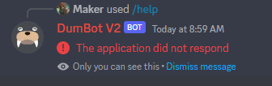
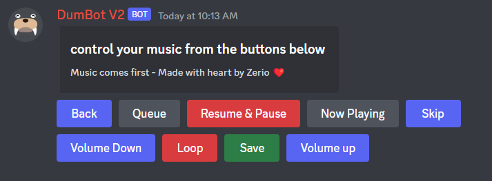
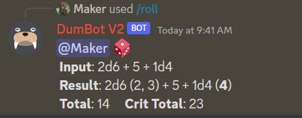

# Using DumBot And The Existing Commands

This file assumes you have already added a version of DumBot to your discord server. In order to accomplish that if you haven't already please reference either of these files before continuing:

- [Use The Existing Instance of DumBot](./Existing-Instance.md)
- [Host & Deploy Your Own Instance of DumBot](./Your-Instance.md)

### Table of Contents

- [The Help Command](#the-help-command)
- [Description of All DumBot Commands](#description-of-all-dumbot-commands)

> **Note**
>
> It is possible that the first 2 or 3 times you try to call DumBot it will say "`The application did not respond`" like this:
>
> 
>
> This is happening because without paying a subscription for DumBot to be up at all times he will go into sleep mode. After 2 or 3 tries this will resolve itself for about 30 minutes of use.
>
> If you would like to stop this from happening I recommend you [Deploy Your Own Instance of DumBot](./Your-Instance.md) and pay for his server to be up at all times. It will typically cost about $5 - $8.

## The Help Command

Now that DumBot has been added to your server, lets test that he is working. You should see underneath DumBot that he is `playing /help`. This is your indicator to type `/help` in the chat in order to find out what he can do! It should look like the following image:

Wonderful! Now you have a list of commands and possibly a description for those commands. Every single DumBot command begins with the `/` prefix, examples are `/roll`, `/play`, and `/dumbot`.

(<a href="#readme-top">back to top</a>)

## Description of All DumBot Commands

  
<strong>Table of Contents</strong>

  <ol>
    <li>
      <a href="#music-commands">Music Commands</a>
      <ul>
        <li><a href="#back">/back</a></li>
        <li><a href="#clear">/clear</a>
        <li><a href="#controller">/controller</a></li>
        <li><a href="#filter">/filter</a></li>
        <li><a href="#jump">/jump</a></li>
        <li><a href="#loop">/loop</a></li>
        <li><a href="#nowplaying">/nowplaying</a></li>
        <li><a href="#pause">/pause</a></li>
        <li><a href="#play">/play</a></li>
        <li><a href="#playnext">/playnext</a></li>
        <li><a href="#queue">/queue</a></li>
        <li><a href="#remove">/remove</a></li>
        <li><a href="#resume">/resume</a></li>
        <li><a href="#save">/save</a></li>
        <li><a href="#search">/search</a></li>
        <li><a href="#seek">/seek</a></li>
        <li><a href="#shuffle">/shuffle</a></li>
        <li><a href="#skip">/skip</a></li>
        <li><a href="#stop">/stop</a></li>
        <li><a href="#volume">/volume</a></li>
      </ul>
    </li>
    <li>
      <a href="#core-commands">Core Commands</a>
      <ul>
        <li><a href="#dumbot">/dumbot</a></li>
        <li><a href="#help">/help</a>
        <li><a href="#ping">/ping</a></li>
        <li><a href="#hroll">/hroll</a></li>
        <li><a href="#roll">/roll</a></li>
      </ul>
    </li>
  </ol>

---

### Music Commands

---

#### back

`/back` goes to the previous song played in your instance of DumBot. If DumBot was disconnected from chat this song will be lost. Be aware it will not go to the previous songs that were in queue but literally the LAST song played. So hitting back twice will return you to the song currently being played, not the song played 2 songs ago.

---

#### clear

`/clear` removes all songs from the queue. Meaning no song will play next and any songs you had set up to play next will be deleted.

---

#### controller

`/controller` allows the user to select a [text channel](https://support.discord.com/hc/en-us/articles/4412085582359-Text-Channels-Text-Chat-In-Voice-Channels) for a music controller to show up in. This controller allows the user to use many of the existing commands in button format. Here is an example of what the controller looks like:

---

#### filter

`/filter` allows the user to add an audio filter to the music being played. The options are as follows:

`bassboost_low` | `bassboost` | `bassboost_high` | `8D` | `vaporwave` | `nightcore` | `phaser` | `tremolo` | `vibrato` | `reverse` | `treble` | `normalizer2` | `normalizer` | `surrounding` | `pulsator` | `subboost` | `karaoke` | `flanger` | `gate` | `haas` | `mcompand` | `mono` | `mstlr` | `mstrr` | `compressor`

---

#### jump

`/jump` allows the user to jump to a specific song in queue. It allows for 2 types of input. Either the `song` or `number` input. It's reccomended you use `number` as it is more accuracte.

- `number` allows you to type the position of the song you'd like to jump to in queue. You kind find out it's position in queue by using the [`/queue` command](#queue).
- `song` allows you to type in the name of the song you'd like to skip to. It must match the name you see in queue exactly or else it will not work. 

---

#### loop

`/loop` allows the user to repeat songs. This has 3 itterations.

- `Song` allows the user to loop the current song
- `Queue` allows the user to loop all songs in Queue
- `Disable` allows the user to stop the loop function

---

#### nowplaying

`/nowplaying` displays the currently playing song along with some extra information. It is formatted as follows:

---

#### pause

`/pause` pauses the current track. It remembers at what point in the song it paused. When you type the command `/resume` it will continue from the point in time that you pressed `/pause`.

---

#### play

`/play` allows the user to play a song based on either `search input`, a `link`, or a `playlist link`. It can work from various sites so try a few different links from various music sites to see if they work.

---

#### playnext

`/playnext` works the same as [`/play`](#play) except it does not accept a `playlist link`. It adds the song you type in to be added to the next position in queue.

---

#### queue

`/queue` shows you all songs that will be played next. 

---

#### remove

`/remove` allows the user to remove a song from queue. You can either type the `number` of the song in queue or the `name` of the song. It's recommended to type the `number` as it is more accurate. To find out the `number` in queue simply type [/queue](#queue)

---

#### resume

`/resume` works hand in hand with the [/pause](#pause) command. If the song has been paused, then using the resume command begins the song at the point at which the song was stopped.

---

#### save

`/save` sends a direct message to the user that used the save command. That message contains information about the currently playing song for the user to reference later.

---

#### search

`/search` allows the user to type a description of the song theyd wish to play such as an artist or the song title. DumBot will respond with 10 options for you to choose from. Answer relatively quickly as DumBot will time out. 

Type your song choice in chat without any commands and the song will be added to queue.

---

#### seek

---

#### shuffle

---

#### skip

---

#### stop

--- 

#### volume

(<a href="#readme-top">back to top</a>)

---

### Core Commands

---

#### dumbot

`/dumbot` displays a simple message when called. He essentially says `Hello I am DumBot. I am very dumb`. It will then edit that message 4 times with new information before finally stopping on the original message.

DumBot began as a simple project where I wanted to see if I could add a bot to a server and have it respond with the most simple command possible. It has since turned into a new beast to where DumBot isn't so dumb anymore!

---

#### help

`/help` displays a hidden message that shows all possible commands in a list. It also links back to this repo and this page for full descriptions of what each command does.

---

#### ping

`/ping` displays the [latency](https://www.cloudflare.com/learning/performance/glossary/what-is-latency/), or ping, of DumBot and his responses.

---

#### hroll

`/hroll` is the exact same as [/roll](#roll) but it is a hidden message. This means that only the user who used the command can see the outcome. Perfect for a Dungeon Master or someone who is running a game.

---

#### roll

`/roll` allows the user to input a string of numbers and dice in order to randomly calculate a total. One thing to note is that every input must be followed by a space. So `1d20+1` is invalid, while `1d20 + 1` is valid. 

The bot will then display the users `Input`, the `Result` of each dice rolled, the `Total` of all dice and numbers using relevant math, and the `Crit Total` which displays the value of all dice rolled times 2 plus all relevant math.

Valid inputs are as follows:

- No input rolls a 20 sided die
- 1d20 or some variation. The number before the `d` determines how many dice are to be rolled. The number after the `d` determines how many sides the dice would have. Ex. 5d10 would roll 5 dice of 10 sides. So therefore 1d20 rolls 1 die of 20 sides
- Math such as `+`, `-`, or `*`. The star `*` represents multiplication.
- Integer such as any whole number (Ex. `5`)

Here a few example inputs:

- `/roll`
- `/roll 1d20 + 1`
- `/roll 5 - 1d6 + 4d10 * 2d2`

This is what the output should look like:

(<a href="#readme-top">back to top</a>)

