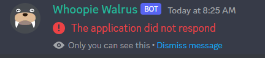
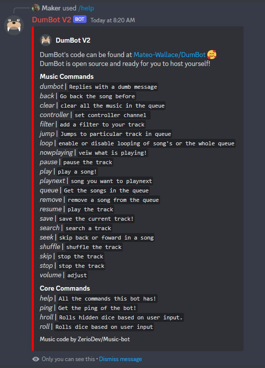

# Using DumBot And The Existing Commands

This file assumes you have already added a version of DumBot to your discord server. In order to accomplish that if you haven't already please reference either of these files before continuing:

- [Use The Existing Instance of DumBot](./Existing-Instance.md)
- [Host & Deploy Your Own Instance of DumBot](./Your-Instance.md)

### Table of Contents

- [The Help Command](#the-help-command)
- [Description of All DumBot Commands](#description-of-all-dumbot-commands)
  - [Music Commands](#music-commands)
  - [Core Commands](#core-commands)

> **Note**
>
> It is possible that the first 2 or 3 times you try to call DumBot it will say "`The application did not respond`" like this:
>
> 
>
> This is happening because without paying a subscription for DumBot to be up at all times he will go into sleep mode. After 2 or 3 tries this will resolve itself for about 30 minutes of use.
>
> If you would like to stop this from happening I recommend you [Deploy Your Own Instance of DumBot](./Your-Instance.md) and pay for his server to be up at all times. It will typically cost about $5 - $8.

## The Help Command

Now that DumBot has been added to your server, lets test that he is working. You should see underneath DumBot that he is `playing /help`. This is your indicator to type `/help` in the chat in order to find out what he can do! It should look like one of the the following images depending on your configuration of DumBot:

 

Wonderful! Now you have a list of commands and possibly a description for those commands. Every single DumBot command begins with the `/` prefix, examples are `/roll`, `/play`, and `/dumbot`.

(<a href="#readme-top">back to top</a>)

## Description of All DumBot Commands

### Music Commands

(<a href="#readme-top">back to top</a>)

### Core Commands

  
Table of Contents

  <ol>
    <li>
      <a href="#about-the-project">About The Project</a>
      <ul>
        <li><a href="#built-with">Built With</a></li>
      </ul>
    </li>
    <li>
      <a href="#documentation">Music Commands</a>
      <ul>
        <li><a href="./src/assets/documentation/Existing-Instance.md">Use The Existing Instance of DumBot</a></li>
        <li><a href="./src/assets/documentation/Your-Instance.md">Host & Deploy Your Own Instance of DumBot</a>
        <li><a href="./src/assets/documentation/Usage.md">Using DumBot And The Existing Commands</a></li>
      </ul>
    </li>
    <li><a href="#contributing">Contributing</a></li>
    <li><a href="#license">License</a></li>
    <li><a href="#contact">Contact</a></li>
    <li><a href="#acknowledgments">Acknowledgments</a></li>
  </ol>

(<a href="#readme-top">back to top</a>)

